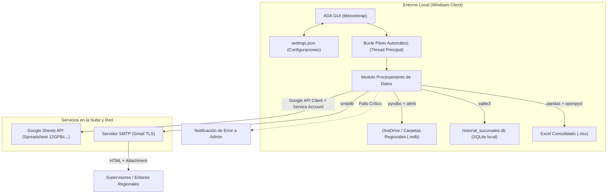

# 🏛️ Arquitectura del Sistema: ADA - Piloto Auto v5.0

El diseño arquitectónico de ADA se basa en una aplicación de escritorio modular que orquesta flujos de trabajo asíncronos para interactuar con bases de datos relacionales locales (Microsoft Access y SQLite), servicios en la nube (Google API Core) y servidores de correo saliente (SMTP).

---

## 🗺️ Mapa de Componentes y Flujo de Datos

A continuación se muestra el diagrama de arquitectura y flujo que representa la ejecución en modo **Piloto Automático**:



---

## 📂 Descripción de Módulos

### 1. Núcleo GUI y Programador: `ADA - Piloto Auto v5.py`
Es el punto de entrada de la aplicación. Se encarga de:
*   **Gestión de Ventanas y Vistas:** Implementa `App` (ventana principal de Tkinter) y `LoginWindow` (seguridad inicial). Incorpora pestañas de monitoreo histórico, logs de sincronización y control de destinatarios de correo.
*   **Piloto Automático (Cron-like):** El método `bucle_piloto_automatico` ejecuta un hilo independiente asíncrono. Monitorea los días seleccionados y corre de forma secuencial los análisis a las **8:00 AM** (o inmediatamente al activar si así se configura). Incluye cálculo adaptativo para ejecutarse obligatoriamente el último día de cada mes.
*   **Procesador de Archivos Access:** La función `procesar_bases_de_datos` recorre las subcarpetas regionales. Identifica el archivo `.mdb` modificado más recientemente, asegura que esté descargado de OneDrive (usando la función `asegurar_archivo_local` y el comando nativo de Windows `attrib +p`), lee la tabla `SALES` mediante `pyodbc` y aplica la normalización de registros.
*   **Conector de Google Sheets:** Actualiza de forma atómica tres áreas clave en la nube:
    *   **Hoja Regional (Resumen de Métricas):** Sube totales mensuales de usuarios por sucursal agregando género y nivel educativo.
    *   **Historial de Sincronización:** Registra la traza diaria detallada de sincronización para cada sucursal (`Historial_{Regional}`).
    *   **Métricas Globales de Sincronización (`PorcSinc`):** Sube el porcentaje acumulado mensual y diario de cumplimiento regional.
*   **Enviador de Correos (SMTP):** Compila el HTML interactivo responsivo de Outlook, segmenta los destinatarios según la regional configurada y despacha el correo adjuntando el reporte Excel generado.

### 2. Capa Histórica SQLite: `sucursales_history.py`
Módulo desacoplado del flujo de interfaz que encapsula la base de datos relacional local:
*   **Esquema de Base de Datos:** Administra la tabla `historial` que contiene `id`, `fecha_reporte`, `regional`, `sucursal`, `dias_sin_sinc` y `observacion`.
*   **Registro Histórico:** Permite insertar por lotes de forma masiva los resultados de sincronización de cada ejecución.
*   **Motor de Estadísticas:** Consulta y calcula promedios de días sin sincronizar, cantidad de incidentes (frecuencia de retraso) y el máximo de días desconectado para cada sucursal de forma individual, alimentando la ventana de diagnóstico de la interfaz principal.

### 3. Ficheros de Configuración e Historial local
*   **`settings.json`:** Almacena de forma persistente los directorios de trabajo locales, destinatarios de correo, credenciales del piloto automático, regionales seleccionadas y el historial de ejecuciones reciente.
*   **`historial_sucursales.db`:** Archivo SQLite local autocreado por la aplicación.
*   **`credentials_gebilo.json`:** Credenciales de cuenta de servicio de Google Cloud. **Archivo crítico y confidencial** sin el cual las integraciones en la nube no se inician.

---

## 🔄 Flujo del Proceso de Análisis (Pipeline de Ejecución)

El procesamiento de datos sigue una serie de fases secuenciales estrictas que garantizan integridad y tolerancia a fallas:

```
[Inicio de Ejecución]
        │
        ▼
[Validación de Directorios] ─── (Verifica que la carpeta raíz exista y tenga contenido)
        │
        ▼
[Descarga de OneDrive] ──────── (Ejecuta 'attrib +p' para asegurar disponibilidad del .mdb)
        │
        ▼
[Extracción PyODBC] ─────────── (Realiza consulta SQL paramétrica sobre la tabla SALES)
        │
        ▼
[Limpieza de Caracteres] ────── (Elimina caracteres de control XML de los strings de texto)
        │
        ▼
[Auditoría ITEMNAME] ────────── (Extrae Género y Tipo de Usuario con algoritmos fallback)
        │
        ▼
[Relleno de Intervalos] ─────── (Inserta filas ficticias 'MES SIN DATOS' en meses inactivos)
        │
        ▼
[Generación de Excel] ───────── (Crea pestañas Datos, Resumen, Servicios e Incidentes con openpyxl)
        │
        ▼
[Carga Google Sheets] ───────── (Sube datos y realiza deduplicación en la nube)
        │
        ▼
[Registro SQLite] ───────────── (Graba histórico local de sucursales en la base de datos)
        │
        ▼
[Despacho de Correo] ────────── (Envía reporte HTML a destinatarios o alerta de error a Admin)
```

---

## 🛡️ Tolerancia a Fallos y Manejo de Hilos

1.  **Hilos Asíncronos (`threading.Thread`):** La GUI nunca se congela. El proceso de carga manual, el programador del piloto automático, el motor de sincronización de Google Sheets y la conexión de correo SMTP corren en hilos de fondo separados.
2.  **Manejo de Errores Críticos:** Si ocurre una excepción inesperada durante la ejecución automatizada, ADA captura el error en su totalidad, escribe la traza detallada en `app.log` y automáticamente despacha un correo HTML de alerta al Administrador del sistema (`vdominguez@infoplazas.org.pa`) para que se tomen medidas inmediatas.
3.  **Mecanismo de Reintentos SMTP:** Para combatir micro-cortes de internet locales en oficinas regionales, el submódulo de correo implementa una estrategia de reintentos (`MAX_RETRIES = 10`) con un delay de retroceso de **60 segundos** entre intentos, asegurando fiabilidad en la distribución.
