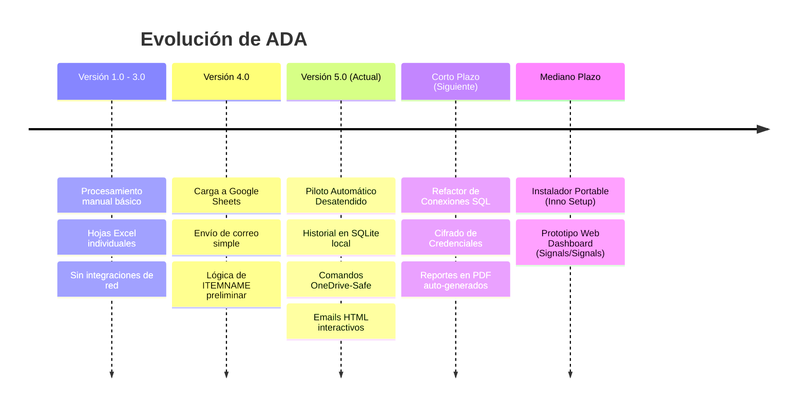

# 🗺️ Hoja de Ruta (Roadmap): ADA - Piloto Auto v5.0

Este documento traza el camino recorrido por el sistema ADA, su estado de madurez actual y los hitos planificados para futuras iteraciones de desarrollo.

---

## 📈 Línea de Tiempo y Versiones

---

## 🚀 Versión 5.0.0 (Estado Actual)

La versión actual representa un salto de calidad en automatización y estabilidad para entornos de producción:

*   **Piloto Automático Inteligente:** Programación semanal autónoma a las 8:00 AM con cálculo adaptativo para fin de mes.
*   **OneDrive-Safe:** Inclusión de comando attrib de Windows para mitigar el error de sincronización de archivos compartidos "solo en la nube".
*   **Auditoría Completa de ITEMNAME:** Algoritmo secuencial con alternancia de sexo estadística y perfiles por defecto.
*   **Persistencia Local Histórica:** Creación de base de datos relacional SQLite local con agregaciones estadísticas de desempeño de sucursales.
*   **Reportes de Alta Fidelidad:** Plantillas HTML interactivas compatibles con Outlook que muestran resúmenes ejecutivos, porcentajes mensuales dinámicos de Google Sheets y tablas con colores semánticos por criticidad.

---

## 🎯 Corto Plazo (Próximas Versiones)

*   **Refactorización del Motor de Base de Datos:**
    *   Migrar consultas directas en strings SQL a un mapeador liviano o pooling robusto.
    *   Asegurar compatibilidad con versiones antiguas del controlador de Access ODBC en sistemas de 32 y 64 bits.
*   **Seguridad de Credenciales:**
    *   Implementar cifrado simétrico local para los tokens y contraseñas de correos (remitente Gmail y claves de API).
    *   Remover variables en duro (`password` y `password_app`) e introducirlas mediante un diálogo seguro de configuración inicial que guarde datos cifrados en `settings.json`.
*   **Reporte PDF Automatizado:**
    *   Generar un informe ejecutivo visual en PDF de una página utilizando librerías como `ReportLab` o `WeasyPrint` para adjuntar opcionalmente en los correos semanales.

---

## 🛠️ Mediano Plazo (Distribución y Modernización)

*   **Paquete de Instalación Profesional:**
    *   Diseñar y compilar un instalador ejecutable `.exe` estructurado utilizando **Inno Setup** o **NSIS** (Nullsoft Scriptable Install System).
    *   El instalador configurará automáticamente los accesos directos de escritorio, registrará las carpetas en el sistema y verificará que el archivo `credentials_gebilo.json` exista en el directorio de trabajo del usuario antes de abrir el software.
*   **Panel de Control Central (Dashboard):**
    *   Migrar la lectura de SQLite del archivo local hacia una arquitectura cliente-servidor o una base de datos centralizada.
    *   Crear una aplicación web de consulta interna (usando frameworks modernos como React o Angular con sistemas reactivos de estado como Signals/GPX-Store) para que la directiva nacional monitoree en tiempo real la salud de todas las regionales simultáneamente sin depender de hojas de cálculo.

---

## 🌐 Largo Plazo (Visión de Futuro)

*   **Migración a Arquitectura Cloud Ingestion:**
    *   Eliminar la dependencia de carpetas de red locales u OneDrive y la necesidad de escanear archivos `.mdb` físicos.
    *   Implementar un agente ligero en cada sucursal que lea las ventas de forma local y envíe las transacciones cifradas directamente a una API REST centralizada.
    *   ADA evolucionaría a un servicio SaaS en la nube con microservicios para análisis de datos, alertas automatizadas en Slack/Teams y generación de reportes programados.
